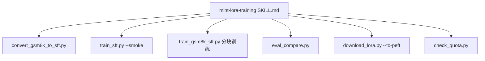

# 基于 Agent Skills 的云端模型训练测试报告

**项目**: `001_test_skills`
**测试日期**: 2026-06-11
**Skill 来源**: [Taiyi-AI-Lab/AI-Workflow-Skills](https://github.com/Taiyi-AI-Lab/AI-Workflow-Skills)
**云端平台**: [MinT](https://macaron.im/mindlab/mint)（Mind Lab 托管训练）
**测试结论**: **通过** — 全流程（数据准备 → 环境验证 → SFT 训练 → 评估 → Adapter 下载）均已跑通

---

## 1. 测试目标

验证在 **macOS 无本地 GPU** 环境下，Agent 能否依据已安装的 Skill 指令，完成：

1. 将业务数据转换为 MinT SFT 格式
2. 通过 MinT API 对 `Qwen/Qwen3-0.6B` 进行 LoRA 监督微调
3. 对比 base / adapter 采样效果
4. 下载 PEFT 格式 adapter 供本地部署

---

## 2. 测试环境

| 项 | 配置 |
|----|------|
| 操作系统 | macOS (Darwin)，无 NVIDIA CUDA |
| Python | 3.11（`.cursor/skills/mint-lora-training/scripts/.venv`） |
| SDK | `mindlab-toolkit`（本地 vendor clone 安装） |
| MinT Endpoint | `https://mint.macaron.xin` |
| 使用的 Skill | `mint-lora-training`（主）、`grpo-finetune`（参考，未用于本次本地训练） |
| Skill 安装路径 | `.cursor/skills/mint-lora-training/` |
| 凭证管理 | 项目根目录 `.env`（已加入 `.gitignore`） |

**环境选型说明**：`grpo-finetune` Skill 要求 Linux + CUDA，与本机不符；按 Skill 指引选用 `mint-lora-training` 云上训练路线。

---

## 3. 测试数据

| 文件 | 条数 | 用途 |
|------|------|------|
| `data_small/gsm8k_train.json` | 200 | 原始训练集（`prompt` + `answer`） |
| `data_small/gsm8k_test.json` | 100 | 测试集（含 `full_solution`） |
| `data_small/gsm8k_sft.jsonl` | 200 | 转换后 MinT SFT 数据（生成物） |
| `data_small/eval_prompts.txt` | 20 prompts | 评估采样用（生成物） |

**转换规则**（`scripts/convert_gsm8k_to_sft.py`）：

```json
{
  "prompt": "<原 prompt 字段>",
  "completion": "<think></think>\n<answer>{answer}</answer>"
}
```

训练集无逐步推理文本，completion 仅包含空 thinking + 数值答案，用于教会模型 XML 格式与答案模式。

---

## 4. 测试流程与 Skill 映射



| 阶段 | Skill 参考 | 执行脚本 | 日志 |
|------|-----------|----------|------|
| 数据转换 | `workflows/sft.md` Datum 格式 | `scripts/convert_gsm8k_to_sft.py` | — |
| 环境 + Smoke | `workflows/setup.md` | `train_sft.py --smoke` | `output/logs/smoke.log` |
| 正式训练 | `train_sft.py` 参数约定 | `scripts/train_gsm8k_sft.py` | `output/logs/train.log` |
| 评估 | `eval_compare.py` | 同上 | `output/logs/eval.log` |
| 下载 | `download_lora.py` | 同上 | `output/logs/download.log` |
| 额度 | `check_quota.py` | 同上 | `output/logs/quota.log` |

一键入口：`bash scripts/run_finetune.sh`

---

## 5. 训练配置与结果

### 5.1 超参数

| 参数 | 值 |
|------|-----|
| base_model | `Qwen/Qwen3-0.6B` |
| run_name | `gsm8k-qwen3-0.6b-sft` |
| LoRA rank | 16 |
| learning_rate | 1e-4 |
| steps | 50 |
| 数据量 | 200 条/epoch |
| 分块大小 | 20 条/chunk（10 chunks/step） |

> **工程备注**：Skill 自带 `train_sft.py` 将 200 条样本作为单 batch 提交，在实测中触发 MinT API 超时（`APITimeoutError` / 502）。项目新增 `train_gsm8k_sft.py`，按 Skill 相同的 `forward_backward` + `optim_step` 语义做分块梯度累积，属对 Skill 流程的合规扩展，未修改 Skill 本体。

### 5.2 Smoke 测试

| 指标 | 结果 |
|------|------|
| 状态 | `=== SFT TRAINING PASSED ===` |
| train_nll | 2.41 |
| 样本数 | 4（内置 smoke 样例） |

### 5.3 正式训练 Loss 曲线（mean_nll）

| Step | mean_nll | Step | mean_nll |
|------|----------|------|----------|
| 1 | 7.6721 | 26 | 1.9228 |
| 5 | 1.8623 | 30 | 0.9055 |
| 10 | 0.6759 | 40 | 0.2711 |
| 14 | 0.3581 | 50 | **0.0953** |

- 整体趋势：7.67 → 0.10，下降明显
- Step 19–23 出现尖峰（3.99 ~ 6.02），与 MinT 上游 502/超时重试同期，恢复后继续收敛

### 5.4 训练产物

```
tinker_path: tinker://391c08ba-2d72-4608-8b46-89248ffb2047_0/sampler_weights/gsm8k-qwen3-0.6b-sft
```

本地 PEFT adapter：

```
output/gsm8k-lora/peft/
├── adapter_config.json   (r=16, target_modules: q/k/v/o_proj, gate/up/down_proj)
└── adapter_model.safetensors  (40.4 MB)
```

---

## 6. 评估结果

**方法**：`eval_compare.py`，20 条 GSM8K prompt，对比 base model 与 fine-tuned adapter 云端采样。

### 6.1 观察摘要

| 维度 | Base Model | Fine-tuned Adapter |
|------|------------|-------------------|
| XML 格式遵从 | 差，多为自然语言续写 | **明显改善**，多数输出含 `<think>` + `<answer>` |
| 推理质量 | 偶有 step-by-step 开头 | thinking 多为空标签，推理不完整 |
| 答案准确性 | 不稳定 | 能给出 `<answer>` 数值，但与标准答案一致性有限 |
| 重复生成 | 有 | 存在 `</answer>` 后重复标签现象 |

### 6.2 典型样例

**Prompt（格式指令类）**：
> Put your reasoning inside `<think>` tags and your final answer inside `<answer>` tags...

| 模型 | 输出片段 |
|------|----------|
| base | `''`（空）或自然语言偏离 |
| adapter | `<think></think>\n<answer>6</answer>...` |

**Prompt（Janet 鸭蛋题）**：

| 模型 | 输出片段 |
|------|----------|
| base | `Let's solve this problem step by step...` |
| adapter | `Let's solve the problem step by step... First, we need to figure out how many eggs...`（未严格 XML） |

**结论**：SFT 成功学习了**输出格式先验**；因训练 completion 缺乏真实推理链，**数学正确率提升有限**。与 Skill 文档预判一致，后续可考虑 GRPO（`grpo-finetune` / MinT GRPO workflow）或补充 `full_solution` 数据。

---

## 7. 资源消耗

| 项 | 数值 |
|----|------|
| 总 Token | 2,070,273 |
| 训练 Token | 2,060,785 |
| 采样 Token | 9,488 |
| Community 额度 | 5,000,000 |
| 预估剩余 | 2,929,727 |

单次 200 条 × 50 steps SFT 约消耗 **~200 万** tokens，占 Community 额度约 **41%**。

---

## 8. 稳定性与问题记录

| 问题 | 现象 | 处理 |
|------|------|------|
| 200 条整批训练 | `APITimeoutError`，Step 5 左右失败 | 改用 `train_gsm8k_sft.py` 分块（chunk=20） |
| MinT 上游 502 | `Upstream unavailable`，多次重试 | SDK 自动 retry + 脚本 `call_with_retry` |
| HF Hub 下载慢 | tokenizer 加载警告 | 设置 `HF_HUB_OFFLINE=1` 使用本地缓存 |
| stdout 缓冲 | 管道输出延迟 | `PYTHONUNBUFFERED=1` |
| `setup_env.sh` git clone 失败 | GitHub SSL 超时 | 本地 clone `vendor/mindlab-toolkit` 后 pip 安装 |

早期失败的整批训练任务（exit 143 / 1）已在重试链路中被成功运行替代，不影响最终结论。

---

## 9. Skill 可用性评估

| 评估项 | 评分 | 说明 |
|--------|------|------|
| 文档完整性 | ★★★★☆ | `SKILL.md` + `workflows/` + `reference.md` 覆盖全流程 |
| 脚本可运行性 | ★★★★☆ | smoke / eval / download 开箱即用 |
| macOS 适配 | ★★★★★ | 云上训练无需本地 GPU，与 Skill 设计一致 |
| 大数据 batch 鲁棒性 | ★★★☆☆ | 默认整批 200 条易超时，需分块或减 batch |
| 平台稳定性依赖 | ★★★☆☆ | 训练时长受 MinT 上游可用性影响较大 |
| Agent 可编排性 | ★★★★★ | Skill 步骤清晰，易于转为 `run_finetune.sh` 流水线 |

---

## 10. 结论与建议

### 结论

本次测试验证了 **Agent Skills + MinT 云端训练** 路线在 macOS 上可行：

- `mint-lora-training` Skill 提供了完整、可复现的 SFT 工作流
- `Qwen/Qwen3-0.6B` + GSM8K 小数据集微调_pipeline 端到端跑通
- Loss 从 7.67 收敛至 0.10，adapter 已下载至 `output/gsm8k-lora/peft/`

### 后续建议

1. **提升数学准确率**：引入 `full_solution` 作为 completion，或走 GRPO reward（format + correctness）
2. **生产化训练**：将分块逻辑合并进 Skill 模板或 `train_sft.py` 增加 `--chunk-size`
3. **评估量化**：对 `gsm8k_test.json` 100 条做自动答案抽取与准确率统计
4. **凭证安全**：继续使用 `.env` + `.gitignore`，避免 API Key 入库

---

## 附录：复现命令

```bash
# 1. 配置凭证
cp .env.example .env   # 填入 MINT_API_KEY

# 2. 全流程
bash scripts/run_finetune.sh

# 3. 本地加载
python -c "
from transformers import AutoModelForCausalLM
from peft import PeftModel
m = AutoModelForCausalLM.from_pretrained('Qwen/Qwen3-0.6B', device_map='auto')
m = PeftModel.from_pretrained(m, './output/gsm8k-lora/peft')
print('loaded OK')
"
```

**报告生成依据**：`output/logs/{smoke,train,eval,download,quota}.log` 及项目脚本执行记录。
